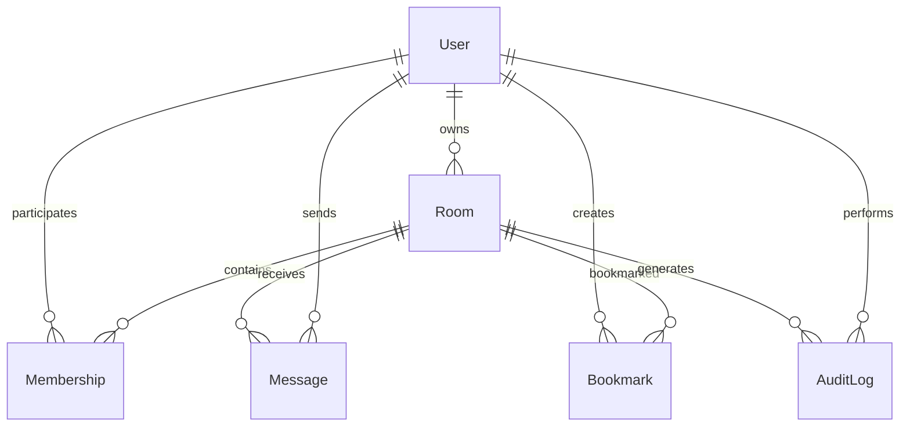

# 04 — Data Model & Information Architecture

## Entity Relationships



## Database Schema

### Users Table
| Field | Type | Constraints / Indexes | Description |
|-------|------|---------------------|-------------|
| `id` | UUID | PK, index | Unique user identifier |
| `alias` | varchar(24) | required, unique per day, index | Display name (unique per day) |
| `createdAt` | timestamp | default now | Account creation time |
| `lastSeenAt` | timestamp | index | Last activity timestamp |

### Rooms Table
| Field | Type | Constraints / Indexes | Description |
|-------|------|---------------------|-------------|
| `id` | UUID | PK | Unique room identifier |
| `name` | varchar(32) | unique, index (case-insensitive) | Room name for joining |
| `passwordHash` | varchar(255) | nullable | Bcrypt hash if password protected |
| `topic` | varchar(140) | nullable | Room description/topic |
| `ownerId` | UUID | FK → User.id, index | Room creator |
| `createdAt` | timestamp | default now | Room creation time |
| `isActive` | boolean | default true | Soft delete flag |

### Memberships Table
| Field | Type | Constraints / Indexes | Description |
|-------|------|---------------------|-------------|
| `id` | UUID | PK | Unique membership identifier |
| `userId` | UUID | FK → User.id, index | Member user |
| `roomId` | UUID | FK → Room.id, index | Room being joined |
| `role` | enum('owner','member') | default 'member' | User role in room |
| `joinedAt` | timestamp | default now | Join timestamp |
| `lastSeenAt` | timestamp | index | Last activity in room |

### Messages Table
| Field | Type | Constraints / Indexes | Description |
|-------|------|---------------------|-------------|
| `id` | UUID | PK | Unique message identifier |
| `roomId` | UUID | FK → Room.id, index | Target room |
| `userId` | UUID | FK → User.id, index | Message sender |
| `body` | text | required, max 500 chars | Message content |
| `messageType` | enum('chat','system','command') | default 'chat' | Message type |
| `createdAt` | timestamp | default now, index(roomId, createdAt) | Send timestamp |

### Bookmarks Table
| Field | Type | Constraints / Indexes | Description |
|-------|------|---------------------|-------------|
| `id` | UUID | PK | Unique bookmark identifier |
| `userId` | UUID | FK → User.id, index | Bookmark owner |
| `roomId` | UUID | FK → Room.id | Bookmarked room |
| `createdAt` | timestamp | default now | Bookmark creation time |
| `UNIQUE(userId, roomId)` | constraint | | Prevent duplicate bookmarks |

### AuditLog Table
| Field | Type | Constraints / Indexes | Description |
|-------|------|---------------------|-------------|
| `id` | UUID | PK | Unique log entry identifier |
| `roomId` | UUID | FK → Room.id, index | Related room |
| `userId` | UUID | FK → User.id, index | Actor user |
| `action` | enum('join','leave','passwd_set','passwd_clear','topic_set','message','create') | required | Action performed |
| `payload` | jsonb | nullable | Additional action data |
| `ipAddress` | varchar(45) | nullable | Actor IP (for security) |
| `createdAt` | timestamp | default now, index(roomId, createdAt) | Action timestamp |

## Data Validation Rules

### Room Names
- 3-32 characters
- Alphanumeric, hyphens, underscores only
- Case-insensitive uniqueness
- No reserved words: `admin`, `api`, `help`, `about`

### User Aliases
- 1-24 characters
- Alphanumeric, hyphens, underscores, dots
- Unique per calendar day (allows reuse)
- No profanity or offensive content

### Passwords
- Minimum 8 characters
- Bcrypt hashing with salt rounds: 12
- No password reuse within 24 hours

### Messages
- 1-500 characters
- HTML escaped on display
- No external links or scripts
- Rate limited: 20 messages per 10 minutes per user

## Indexes for Performance

```sql
-- Primary indexes
CREATE INDEX idx_users_alias ON users(alias);
CREATE INDEX idx_rooms_name ON rooms(name);
CREATE INDEX idx_memberships_user_room ON memberships(user_id, room_id);
CREATE INDEX idx_messages_room_time ON messages(room_id, created_at);
CREATE INDEX idx_audit_room_time ON audit_log(room_id, created_at);

-- Composite indexes
CREATE INDEX idx_memberships_room_active ON memberships(room_id, last_seen_at) WHERE last_seen_at > NOW() - INTERVAL '1 hour';
CREATE INDEX idx_messages_room_type ON messages(room_id, message_type, created_at);
```
